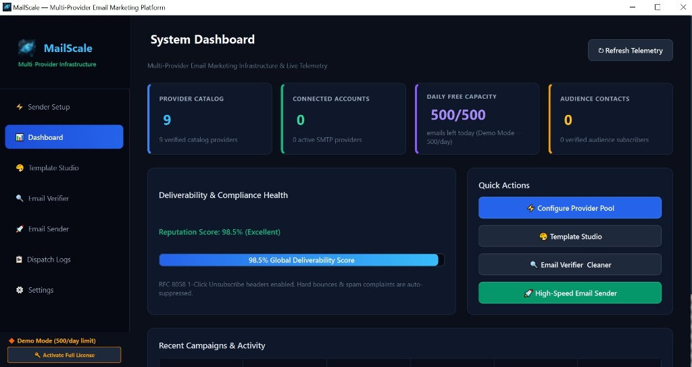
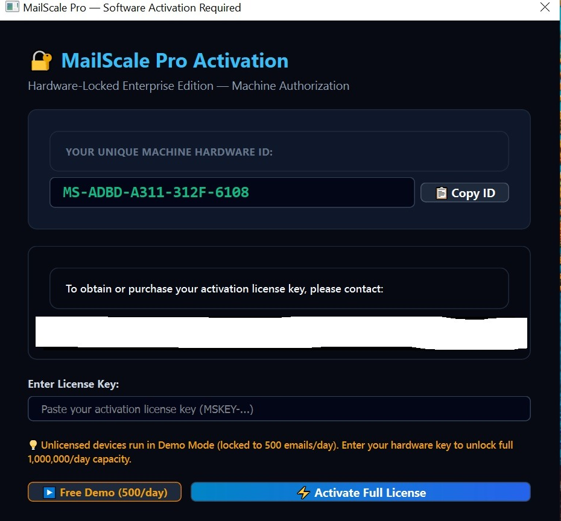

<div align="center">

# MailScale™ Enterprise

### Multi-Provider Email Orchestration & High-Deliverability Infrastructure

[](releases/MailScale.EXE)
[-0078D4.svg?style=for-the-badge&logo=windows&logoColor=white)](releases/MailScale.EXE)
[-30D158.svg?style=for-the-badge)](#deliverability--compliance)
[](#deliverability--compliance)
[](releases/MailScale.EXE)

<br/>

<p align="center">
  <b>MailScale</b> is a next-generation desktop email infrastructure and campaign orchestration platform engineered for high-volume senders. It unites commercial cloud providers and private enterprise SMTP relays into a single, high-deliverability dispatch engine featuring real-time health telemetry, intelligent traffic balancing, and automated compliance enforcement.
</p>

<p align="center">
  <a href="docs/architecture.md"><b>🏛️ Solution Architecture</b></a> •
  <a href="SECURITY.md"><b>🛡️ Security Overview</b></a> •
  <a href="CHANGELOG.md"><b>📜 Release Notes</b></a>
</p>

</div>

---

## 📸 Executive Visual Interface

### System Dashboard & Real-Time Telemetry
Centralized command console displaying active provider relays, daily capacity quotas, audience subscriber metrics, deliverability health benchmarks, and immediate quick-action launchpads.

<div align="center">
  
</div>

<br/>

### Hardware Authorization & License Management
Secure workstation authorization model. Devices run immediately in **Free Demo Mode (500 emails/day)** for evaluation, with instant enterprise unlocking for unthrottled high-volume campaigns.

<div align="center">
  
</div>

---

## ⚡ Key Highlights

| Capability | Enterprise Value |
| :--- | :--- |
| **Multi-Relay Pool Aggregation** | Unify private corporate SMTPs and cloud API relays (SendGrid, Mailjet, Brevo, Resend, Amazon SES) under one intelligent pool. |
| **Dynamic Traffic Balancing** | Smart routing algorithm balances message volume across healthy relays to preserve domain reputation and avoid rate throttling. |
| **98.5% Deliverability Benchmark** | Built-in reputation monitoring and pre-flight deliverability heuristics ensure maximum inbox placement. |
| **RFC 8058 1-Click Unsubscribe** | Automated injection of compliant `List-Unsubscribe` headers meeting strict 2024+ inbox provider standards (Google & Yahoo). |
| **Pre-Flight Audience Cleaner** | Integrated email verifier detects syntax anomalies, deduplicates contact lists, and quarantines high-risk addresses prior to send. |
| **Visual Template Studio** | Compose rich HTML and plain-text templates with real-time preview and dynamic subscriber personalization tags. |
| **High-Throughput Dispatcher** | Multi-threaded asynchronous dispatch pipeline engineered for seamless high-speed campaign execution without UI lag. |
| **Privacy-First Local Storage** | All contact databases, campaign data, and credentials remain 100% local on your workstation. Zero external data retention. |

---

## 🚀 Rapid Deployment (Zero Configuration)

MailScale is delivered as a 100% portable, self-contained Windows executable. **No external runtimes, frameworks, or database installations required.**

1. **Obtain the Executable**:
   - Access the release binary from [`releases/MailScale.EXE`](releases/MailScale.EXE).
2. **Launch Instantly**:
   - Double-click `MailScale.EXE` on any 64-bit Windows 10 or Windows 11 system.
3. **Start in Free Demo Mode**:
   - Click **`▶ Free Demo (500/day)`** to immediately access all platform modules with a complimentary 500 emails/day capacity.
   - Enter your enterprise license key at any time to remove daily limits and unlock full enterprise capacity.

---

## 🌐 Supported Gateway Protocols & Providers

MailScale connects seamlessly with enterprise email relays and global cloud providers:

- **Corporate & Custom SMTP**: Authenticated transmission via STARTTLS (Port 587), SSL/TLS (Port 465), or custom corporate relays.
- **SendGrid Integration**: Cloud API delivery with token authentication and real-time delivery telemetry.
- **Mailjet Infrastructure**: High-speed European and global relay infrastructure.
- **Brevo (Sendinblue)**: Transactional and marketing API pipeline support.
- **Resend**: Modern developer-grade email gateway integration.
- **Amazon SES**: Enterprise high-volume cloud email delivery.

---

## 🛡️ Deliverability & Compliance Standards

MailScale enforces strict adherence to international email delivery standards:
- **RFC 8058 & RFC 2369**: Automatic one-click unsubscribe headers with automated suppression list updates.
- **RFC 5321 & RFC 5322**: Exact message structure, MIME encoding, and transport syntax compliance.
- **Anti-Spam & Privacy**: Built-in support for CAN-SPAM, CASL, and GDPR opt-out requirements.
- **Local Credential Vault**: All relay credentials and access tokens are secured at rest using local encryption.

For detailed operational specifications, review the [Solution Architecture](docs/architecture.md).

---

## 📂 Release Repository Structure

```text
MailScale
│
├── README.md             # Executive overview, feature catalog & quickstart
├── LICENSE               # Licensing terms & commercial evaluation grant
├── SECURITY.md           # Security perimeter, credential safety & disclosure
├── CHANGELOG.md          # Version history & product release notes
├── .gitignore            # Clean workspace repository exclusions
│
├── docs/
│   └── architecture.md   # Enterprise solution architecture & topology
│
├── assets/
│   ├── dashboard_preview.jpg   # High-resolution dashboard screenshot
│   ├── activation_preview.jpg  # Workstation licensing interface preview
│   └── app_icon.ico            # Official brand iconography
│
└── releases/
    └── MailScale.EXE     # Standalone portable Windows executable (~38 MB)
```

---

## 💼 Enterprise Licensing & Support

MailScale is licensed for commercial and enterprise operations:
- **Free Evaluation Edition**: Standard 500 emails/day quota enabled on all installations for platform testing and evaluation.
- **Enterprise Workstation License**: Unrestricted daily sending capacity, priority routing configurations, and customized gateway integrations.

To obtain or upgrade your workstation authorization license, contact your designated MailScale distribution representative.

---

<div align="center">
  <sub>© 2026 MailScale Systems. All rights reserved. Proprietary software.</sub>
</div>
